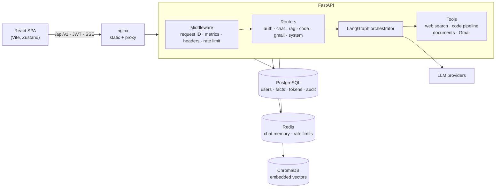

# Pluto

<p align="center">
	
</p>

Pluto is a multi-agent AI workspace: a LangGraph orchestrator that answers questions with
streaming responses and decides when to call tools — web search, a code
generation + review pipeline, retrieval over your own documents (RAG), and your Gmail
inbox. It runs on any major LLM provider (Google Gemini, OpenAI, Anthropic, Groq,
OpenRouter, or local Ollama) behind one provider abstraction.

## Highlights

- **Streaming agent chat** — tokens stream over Server-Sent Events, and the live topology
  map lights up the tools the agent *actually* calls.
- **Per-user isolation** — conversations, long-term facts, and documents are scoped to the
  signed-in account; a tool can only touch the calling user's data.
- **Secure by default** — verified Google sign-in, hardened JWTs, PBKDF2 (600k) password
  hashing with transparent upgrades, OAuth tokens encrypted at rest, CSRF-protected Gmail
  linking, rate limiting, strict CORS, security headers, audit log.
- **Operable** — structured JSON logs with request IDs, Prometheus metrics, liveness and
  readiness probes, graceful degradation when Redis or PostgreSQL is down.
- **Shippable** — multi-stage non-root Docker images, a full `docker compose` stack, CI with
  linting, type checking, tests, and dependency vulnerability audits.

## Architecture



| Layer | Location | Responsibility |
|---|---|---|
| Entry point | `app.py` | App factory, lifespan (config checks, migrations), middleware |
| HTTP API | `api/v1/` | One router per domain; thin, validated, authenticated |
| Cross-cutting | `core/` | Logging, errors, security (JWT/passwords), rate limits, metrics, crypto |
| Agents | `agents/` | Orchestrator graph, RAG, Gmail, code generator / critic |
| Tools | `tools/` | Per-request tool factories bound to the calling user |
| Data | `memory/`, `rag/` | PostgreSQL (pooled, migrated), Redis, ChromaDB |
| Providers | `llm_provider/` | Provider-agnostic model construction |
| Frontend | `frontend/src/` | Typed API client (`lib/api.ts`), stores, panels |

## Quick start (Docker)

```bash
cp .env.example .env
```

Set at least `JWT_SECRET_KEY`, `TOKEN_ENCRYPTION_KEY`, `POSTGRES_PASSWORD`, and one LLM key
in `.env` (generation commands are in the file), then:

```bash
docker compose up --build
```

Open http://localhost:8080. The stack runs nginx + the SPA, the API, PostgreSQL, and Redis,
with data persisted in named volumes. The API container starts in `production` mode and
refuses to boot with insecure configuration.

## Local development

Requirements: Python 3.11+, Node 22+. PostgreSQL and Redis are optional locally — without
them the API runs in a degraded mode (no accounts/Gmail; in-memory chat history), and guest
sessions still work.

```bash
pip install -r requirements-dev.txt
cp .env.example .env
python -m uvicorn app:app --reload
```

```bash
cd frontend
cp .env.example .env
npm ci
npm run dev
```

Or start both with `./start.sh` (stop with `./stop.sh`). API docs: http://localhost:8000/docs.

## Configuration

All settings are environment variables (see [`.env.example`](.env.example) for the full,
commented list). The important ones:

| Variable | Purpose |
|---|---|
| `ENVIRONMENT` | `production` enables fail-fast config checks, HSTS, and hides API docs |
| `JWT_SECRET_KEY` | Signs session tokens. Required (≥ 32 chars) in production |
| `TOKEN_ENCRYPTION_KEY` | Fernet key encrypting Gmail OAuth tokens at rest |
| `CORS_ORIGINS` | Comma-separated allowed browser origins (no wildcards) |
| `LLM_PROVIDER` / `LLM_MODEL` / `LLM_API_KEY` | Default model; blank provider auto-detects from the key |
| `POSTGRES_URL`, `REDIS_URL` | Data stores (both optional in development) |
| `GOOGLE_CLIENT_ID` | Enables "Sign in with Google"; other OAuth clients' tokens are rejected |
| `GMAIL_WEB_CLIENT_ID` / `_SECRET` / `GMAIL_REDIRECT_URI` | Gmail integration |
| `RATE_LIMIT_PER_MINUTE`, `AUTH_RATE_LIMIT_PER_MINUTE` | Per-client request budgets |
| `ALLOW_GUEST_ACCESS` | Short-lived anonymous sessions from "Continue as Guest" |
| `LOG_FORMAT` | `json` for log aggregators, `text` for humans |

Users may also supply their own provider key in the top bar; it's sent per request and
never stored server-side. A server-side key is only ever sent to the provider it belongs to.

## API

All endpoints live under `/api/v1`. Errors share one shape:
`{"detail": "...", "code": "machine_code", "request_id": "..."}` — quote the request ID
when reporting a problem; it links to the server log entry.

| Area | Endpoints |
|---|---|
| System | `GET /health`, `GET /health/ready`, `GET /config/llm`, `GET /config/auth`, `GET /agents/status` |
| Auth | `POST /auth/signup`, `POST /auth/login`, `POST /auth/google`, `POST /auth/guest`, `GET /auth/me` |
| Chat | `POST /chat`, `POST /chat/stream` (SSE), `DELETE /chat/{session_id}/history` |
| RAG | `POST /rag/ingest`, `GET /rag/documents`, `DELETE /rag/documents[/{source}]`, `POST /rag/query` |
| Code | `POST /code/generate`, `POST /code/critic` |
| Gmail | `GET /gmail/connect`, `GET /gmail/status`, `POST /gmail/disconnect`, `GET /gmail/list`, `GET /gmail/get/{id}`, `POST /gmail/summarize` |

Everything except System and the sign-in endpoints requires `Authorization: Bearer <token>`.
Gmail requires a registered (non-guest) account.

`POST /chat/stream` emits `start`, `token`, `tool_start`, `tool_end`, and finally `done`
(the full answer) or `error`.

## Observability

- **Logs** — one line per request with method, path, status, duration, request ID, and user
  ID; agent calls log provider, outcome, and latency. `LOG_FORMAT=json` for ingestion.
- **Metrics** — `GET /metrics` (Prometheus): `pluto_http_requests_total`,
  `pluto_http_request_duration_seconds`, `pluto_llm_calls_total`,
  `pluto_llm_call_duration_seconds`, `pluto_documents_ingested_total`.
- **Probes** — `/api/v1/health/live` (process up) and `/api/v1/health/ready` (dependency
  status; returns 503 in production when PostgreSQL is unreachable).
- **Audit log** — sign-ups, logins (including failures), Gmail link/unlink, and knowledge-base
  changes are written to the `audit_log` table.

## Quality gates

```bash
ruff check .                 # lint (incl. security rules)
pytest --cov                 # 87 tests: security, API contracts, isolation, streaming, agents
cd frontend && npm run check # typecheck + lint + production build
```

CI (`.github/workflows/ci.yml`) runs all of the above plus `pip-audit` and `npm audit`, and
builds both Docker images. Dependabot keeps dependencies current.

## Upgrading from 1.x

- **Sign in again.** Session tokens are now signed, scoped, and validated differently.
- **All feature endpoints require authentication.** The bundled frontend handles this;
  custom API clients must send a bearer token (use `POST /auth/guest` for anonymous access).
- **`POST /auth/google`** now takes a Google `access_token`, `id_token`, or authorization
  `code`, never a raw email.
- **Documents are per-user.** Chunks ingested before 2.0 have no owner; assign them with
  `python -m scripts.assign_legacy_documents --owner <user_id>` (add `--dry-run` to preview).
- **LLM provider failures return 502** (was 400), with a friendlier message.
- Database schema changes apply automatically at startup (`schema_migrations` table).

See [CHANGELOG.md](CHANGELOG.md) for the full list and [SECURITY.md](SECURITY.md) for the
security model.

## License

This project is proprietary and confidential. Please refer to the internal documentation for
licensing terms.
